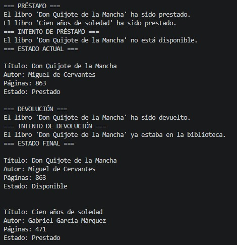
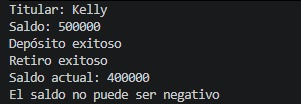
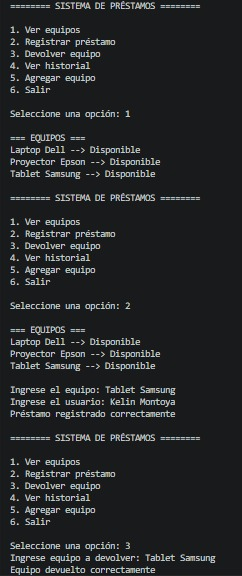

# GA1-220501093-04-AA1-EV04  
# Fundamentos de Python: Clases, Objetos y Encapsulación

## Autor
Victor Montoya

---

# Descripción del Proyecto

Este proyecto fue desarrollado como solución a la actividad:

**GA1-220501093-04-AA1-EV04 – Fundamentos de Python: Clases, Objetos y Encapsulación**

El objetivo principal de esta actividad fue aplicar los conceptos fundamentales de Programación Orientada a Objetos (POO) en Python mediante ejercicios prácticos y un proyecto integrador.

Durante el desarrollo del trabajo se implementaron conceptos como:

- Clases
- Objetos
- Métodos
- Constructores
- Encapsulación
- Listas
- Tuplas
- Diccionarios
- Menús interactivos

El proyecto final desarrollado fue un:

## Sistema de Préstamos de Equipos

El sistema permite administrar préstamos de equipos tecnológicos dentro de una institución educativa o empresarial.

---

# Objetivos del Proyecto

- Comprender el funcionamiento de las clases y objetos en Python.
- Aplicar encapsulación para proteger atributos sensibles.
- Utilizar listas, tuplas y diccionarios en aplicaciones reales.
- Desarrollar programas funcionales usando Programación Orientada a Objetos.
- Implementar un menú interactivo para gestionar préstamos de equipos.

---

# Estructura del Proyecto

```plaintext
GA1-220501093-04-AA1-EV04/
│
├── ejemplos_clases_objetos/
│   ├── persona.py
│   ├── carro.py
│   ├── estudiante.py
│   └── animal.py
│
├── taller_clases_objetos/
│   └── libro.py
│
├── taller_encapsulacion/
│   └── cuenta_bancaria.py
│
├── proyecto_final_prestamos/
│   └── prestamos_equipos.py
│
├── capturas/
│   ├── libro.png
│   ├── cuenta_bancaria.png
│   └── prestamos.png
│
└── README.md
```

---

# Explicación del Diseño de Clases y Encapsulación

## Diseño de Clases

El proyecto fue desarrollado utilizando Programación Orientada a Objetos (POO) con el objetivo de organizar mejor el código y representar entidades reales mediante clases y objetos.

---

## Clase Libro

La clase `Libro` representa libros dentro de una biblioteca.

### Atributos:
- titulo
- autor
- paginas
- disponible

### Métodos:
- prestar()
- devolver()
- informacion()

Esta clase permite gestionar préstamos y devoluciones de libros.

---

## Clase CuentaBancaria

La clase `CuentaBancaria` fue desarrollada para aplicar el concepto de encapsulación.

### Atributos:
- _titular
- _saldo

### Métodos:
- depositar()
- retirar()

También se implementaron properties para controlar el acceso a los atributos privados.

---

## Clase Equipo

La clase `Equipo` representa cada equipo tecnológico dentro del sistema de préstamos.

### Atributos:
- nombre
- disponibilidad
- historial de préstamos

### Métodos:
- prestar()
- devolver()
- disponible()

---

## Clase Usuario

La clase `Usuario` representa las personas que solicitan préstamos de equipos.

---

## Clase Prestamo

La clase `Prestamo` representa cada préstamo realizado dentro del sistema.

---

# Encapsulación

La encapsulación se aplicó para proteger atributos sensibles del sistema.

Por ejemplo:

- En la clase `CuentaBancaria`, el saldo fue protegido para evitar valores negativos.
- En la clase `Equipo`, el estado de disponibilidad fue encapsulado usando un atributo privado.

Esto permite tener mayor control sobre la información y evita modificaciones incorrectas desde fuera de la clase.

---

# Ejemplos de Ejecución

## Taller de Clases y Objetos

### Ejecución de libro.py



---

## Taller de Encapsulación

### Ejecución de cuenta_bancaria.py



---

## Proyecto Final – Sistema de Préstamos

### Ejecución de prestamos_equipos.py



---

# Explicación del Funcionamiento del Sistema

El sistema de préstamos funciona mediante un menú interactivo que permite al usuario realizar diferentes operaciones.

## Funciones principales del sistema

### Ver equipos
Muestra todos los equipos registrados y su estado actual.

### Registrar préstamo
Permite prestar un equipo disponible a un usuario.

### Devolver equipo
Permite cambiar el estado de un equipo nuevamente a disponible.

### Ver historial
Muestra todos los préstamos realizados.

### Agregar equipo
Permite registrar nuevos equipos en el sistema.

---

# Conceptos Aplicados

| Concepto | Aplicación |
|---|---|
| Clases | Libro, CuentaBancaria, Equipo, Usuario, Prestamo |
| Objetos | Instancias creadas en el sistema |
| Encapsulación | Protección de atributos sensibles |
| Listas | Historial de préstamos |
| Tuplas | Registro de usuario y fecha |
| Diccionarios | Almacenamiento de equipos |

---

# Tecnologías Utilizadas

- Python 3
- Visual Studio Code
- Git
- GitHub

---

# Cómo Ejecutar el Proyecto


## 1. Abrir carpeta del proyecto

```bash
cd GA1-220501093-04-AA1-EV04
```

---

## 2. Ejecutar los archivos

Ejemplo:

```bash
python libro.py
```

o

```bash
python prestamos_equipos.py
```

---

# Aprendizajes Obtenidos

Durante el desarrollo de esta actividad aprendí:

- Cómo crear clases y objetos en Python.
- Cómo utilizar constructores y métodos.
- Cómo proteger información sensible mediante encapsulación.
- Cómo organizar información usando listas, tuplas y diccionarios.
- Cómo desarrollar programas interactivos utilizando menús.
- Cómo estructurar proyectos en Python de forma organizada.

---

# Dificultades Encontradas

Algunas dificultades durante el desarrollo del proyecto fueron:

- Comprender el funcionamiento de `self`.
- Entender la encapsulación y los atributos privados.
- Manejar correctamente listas y diccionarios dentro del sistema.
- Organizar la lógica del menú interactivo.

Estas dificultades fueron superadas mediante práctica, pruebas constantes y corrección de errores en el código.

---

# Reflexión Personal

Durante el desarrollo de esta actividad aprendí a implementar Programación Orientada a Objetos en Python utilizando clases, objetos y encapsulación.

Uno de los aprendizajes más importantes fue comprender cómo funcionan los constructores y el uso de `self` dentro de las clases.

También aprendí a proteger información sensible mediante encapsulación utilizando atributos privados y properties.

En el proyecto final tuve el reto de organizar correctamente la lógica del sistema de préstamos utilizando listas, tuplas y diccionarios. Al principio fue difícil manejar todas las estructuras al mismo tiempo, pero mediante práctica y pruebas constantes logré comprender su funcionamiento.

Esta actividad me permitió fortalecer mis habilidades de programación, lógica y organización del código, además de entender cómo aplicar POO en proyectos reales.

---

# Conclusión

Este proyecto permitió aplicar de manera práctica los conceptos fundamentales de Programación Orientada a Objetos en Python.

Gracias a esta actividad fue posible comprender cómo funcionan las clases, los objetos y la encapsulación en el desarrollo de aplicaciones reales.

Además, se fortalecieron habilidades relacionadas con lógica de programación, organización del código y resolución de problemas.

---

# Repositorio GitHub

https://github.com/KelinMontoya/GA1-220501093-04-AA1-EV04.git